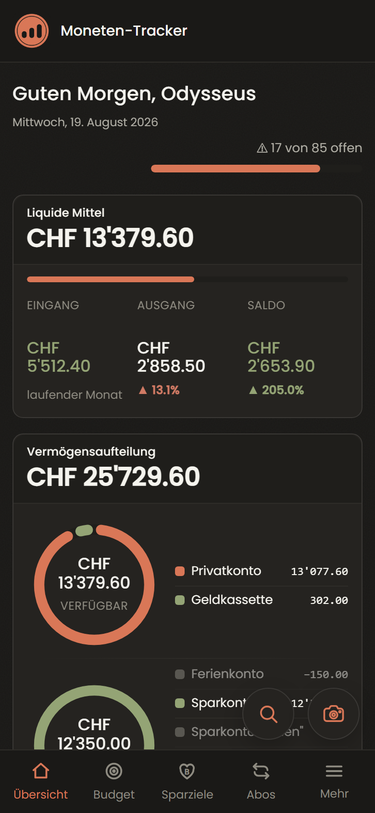
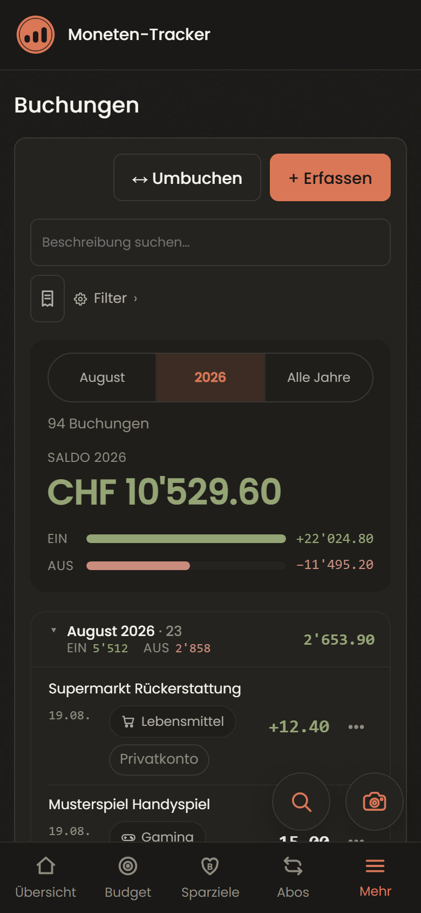
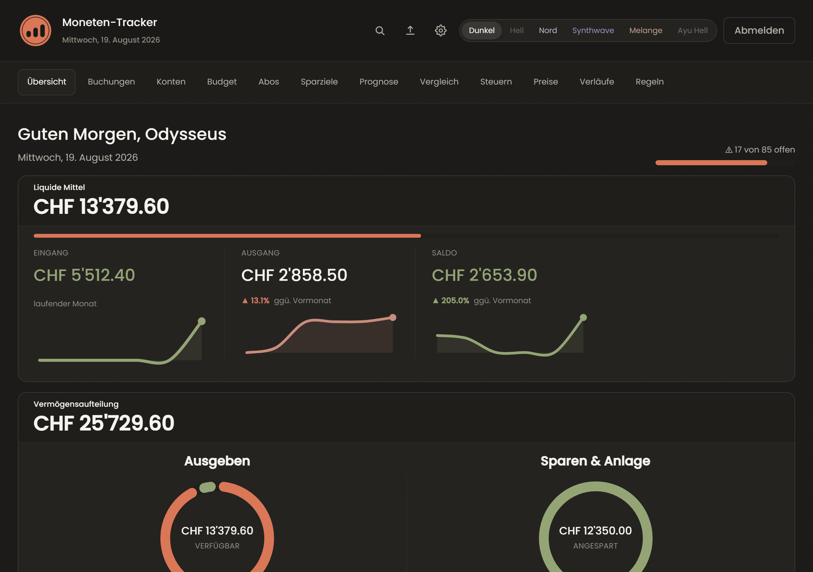
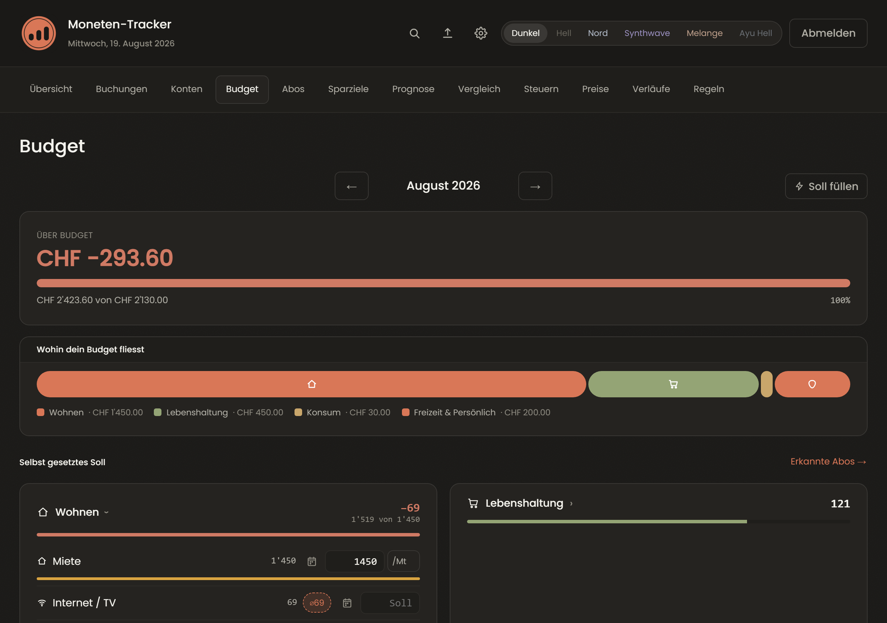
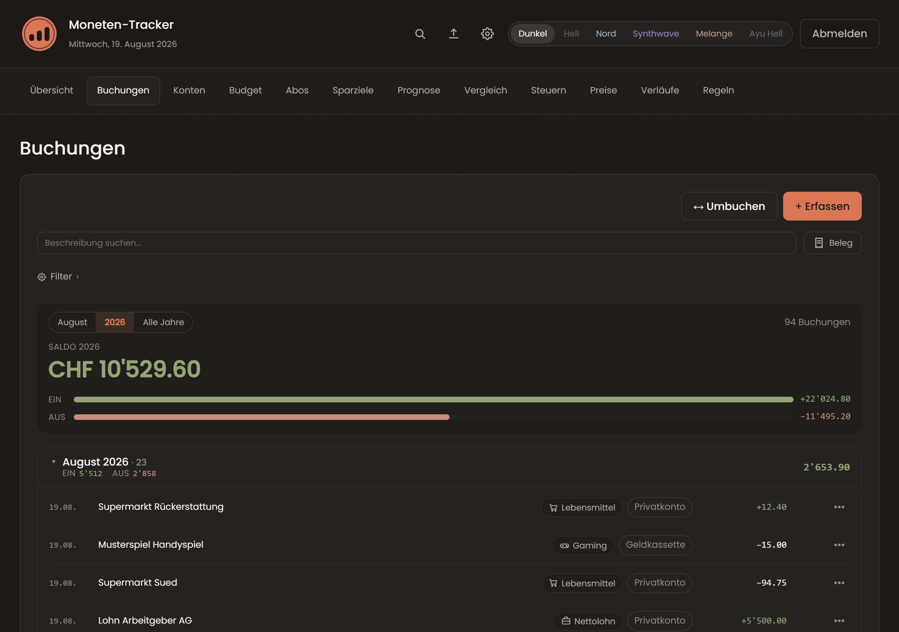
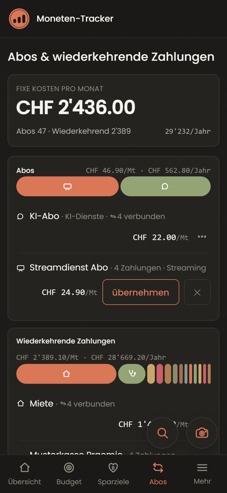

# Moneten-Tracker

Selbstgehostete Budget- und Finanz-App für **eine** Person. Läuft als
Docker-Container im eigenen Netz, bedienbar im Browser und als PWA auf dem
Handy. Deutschsprachige Oberfläche, auf Schweizer Verhältnisse zugeschnitten
(CHF, CAMT.053-Bankdateien, Krankenkassen-Policen, Vorsorgeausweis).

**Offline-first im Wortsinn:** die App macht zur Laufzeit keinen einzigen
Aufruf nach draussen. Keine Wechselkurs-API, kein CDN, keine Telemetrie, kein
Konto bei irgendwem. Was sie weiss, steht in der eigenen Datenbank.

| | |
|:--|:--|
|  |  |
| **Übersicht** — Kennzahlen, Vermögensaufteilung, Geldfluss | **Buchungen** — Zeitstrahl mit Monatskarten, Filter, Belege |



<details>
<summary>Mehr Bilder</summary>





</details>

Alle Zahlen und Händler in diesen Bildern sind **erfunden** — sie kommen aus dem
Demo-Server (`scripts/_dev_server.py`), nicht aus einer benutzten Installation.

---

## Was sie kann

| Bereich | Kurz |
|---|---|
| **Übersicht** | Kennzahlen, Donut, Sankey, Treemap, Geldfluss des Monats |
| **Buchungen** | Zeitstrahl, Filter, Splits, Umbuchungen, Belege an der Buchung |
| **Konten** | Vermögensverlauf, Kassensturz, Saldo-Abgleich mit dem Auszug |
| **Budget** | Soll/Ist je Kategorie, Median-Vorschlag, Ampel, Jahreskosten |
| **Abos** | erkennt wiederkehrende Zahlungen selbst, inkl. Kündigungsfristen |
| **Sparziele** | Prognose, Rückstellungen, gemeinsamer Spar-Topf für zwei Personen |
| **Prognose** | Fortschreibung + Stresstest („was, wenn die Miete steigt") |
| **Import** | CAMT.053 und CSV, Dublettenerkennung, IBAN-Zuordnung |
| **Quittungen** | Foto oder PDF → OCR → Positionen, Abgleich gegen die Buchung |
| **Verläufe** | Kennzahlen aus Belegen über Jahre (Prämie, Steuern, Lohn, Rechnungen) |
| **Regeln** | Stichwort → Kategorie, plus Inbox für alles Unzugeordnete |

Bedienung ist auf das Handy ausgelegt: eine Spalte, grosse Ziele, alles ohne
Zoom lesbar. Auf dem Desktop wird daraus mehr Fläche, nicht ein anderes Programm.

## Was sie nicht ist

* **Kein Mehrbenutzer-System.** Ein Login, eine Datenbank, ein Mensch.
* **Kein Cloud-Dienst.** Es gibt keinen Server, der etwas synchronisiert.
* **Kein Buchhaltungspaket.** Keine doppelte Buchführung, keine Mandanten,
  keine MwSt-Abrechnung.
* **Nicht sprachneutral.** Oberfläche, Belegerkennung und Kategorien sind
  deutsch und schweizerisch. Wer anderswo lebt, muss anpassen.

---

## Installation

Voraussetzung: Docker mit Compose. Getestet auf einem Synology-NAS und auf
einem gewöhnlichen Linux-Rechner.

**Du brauchst den Quelltext nicht.** Es gibt ein fertiges Abbild; zwei Dateien
genügen:

```bash
mkdir moneten && cd moneten
curl -O https://raw.githubusercontent.com/NaevdeSeidhe/moneten-tracker/main/docker-compose.yml
curl -O https://raw.githubusercontent.com/NaevdeSeidhe/moneten-tracker/main/.env.example
cp .env.example .env
```

Wer ohnehin am Quelltext arbeiten will, klont stattdessen das Repository und
baut selbst — dazu unten unter [Selbst bauen](#selbst-bauen).

Jetzt `.env` öffnen. Nötig ist **ein** Eintrag:

```bash
MONETEN_DB_KEY=<langer Zufallswert — ohne ihn bleibt die Datenbank Klartext>
```

Den Schlüssel erzeugt zum Beispiel:

```bash
python3 -c "import secrets; print(secrets.token_urlsafe(48))"
```

> **Diesen Schlüssel sichern, bevor die App startet.** Er verschlüsselt die
> Datenbank (SQLCipher, AES-256). Ist er weg, ist die Datenbank weg — es gibt
> keine Hintertür, und das ist der Sinn der Sache. Ihn **nachträglich** zu
> setzen geht nicht: eine bereits angelegte Klartext-Datenbank lässt sich damit
> nicht mehr öffnen.

Die Start-PIN lässt man am besten leer. Die App würfelt dann eine und schreibt
sie einmal ins Protokoll:

```bash
docker compose up -d
docker compose logs moneten | grep Start-PIN
```

Der Container wandert beim Start selbst auf den neuesten Datenbankstand
(`alembic upgrade head`) und startet danach den Webserver. Nach dem ersten
Login verlangt die App sofort eine eigene PIN — vorher ist keine Seite
erreichbar.

### Auf dem neuesten Stand bleiben

```bash
docker compose pull
docker compose up -d
```

Das war es. Deine Daten liegen im Ordner `data/` neben der Compose-Datei und
werden nicht angefasst; ausstehende Datenbank-Änderungen zieht der Container
beim Start selbst nach. Auf einem Synology-NAS geht dasselbe ohne Konsole:
**Container Manager → Projekt → Aktion → Neu erstellen**.

Zwei Dinge, die dazugehören:

* **Vorher sichern.** `scripts/backup.sh` zieht einen konsistenten Schnappschuss
  der Datenbank samt Belegen — siehe [Sichern und
  Wiederherstellen](#sichern-und-wiederherstellen). Ein Update ist der eine
  Moment, in dem sich eine Sicherung bezahlt macht.
* **Stehenbleiben geht auch.** Ohne Angabe holt Compose die neuste Fassung. Wer
  das nicht will, trägt `MONETEN_FASSUNG=0.81.0` in die `.env` ein; dann bleibt
  der Stand, bis du die Zahl änderst.
* **Ganz festnageln geht auch.** Eine Marke wie `latest` oder `0.82.0` ist ein
  Zeiger und lässt sich umhängen — wer Schreibrecht auf die Registry erlangt,
  schiebt ein anderes Abbild darunter, und dein nächstes `docker compose pull`
  holt es. Ein Digest lässt sich nicht umhängen. Statt der Marken-Zeile in
  `docker-compose.yml`:

  ```yaml
      image: ghcr.io/<konto>/moneten-tracker@sha256:<digest>
  ```

  Der Digest steht in der Zusammenfassung des Bau-Laufs (Actions → „Abbild
  bauen") und bei jeder Fassung auf der Paket-Seite.

**Woher kommt dieses Abbild eigentlich?** An jedem veröffentlichten Abbild hängt
seit v0.82.0 eine **Herkunftsbescheinigung**: ein signierter Nachweis, welcher
Bau-Lauf in welchem Repository es aus welchem Commit gebaut hat. Prüfen kannst
du das selbst, ohne mir zu glauben:

```bash
gh attestation verify oci://ghcr.io/<konto>/moneten-tracker:latest --owner <konto>
```

Die Signatur entsteht kurzlebig über Sigstore; es gibt keinen privaten
Schlüssel, den jemand stehlen könnte. Kommt hier kein grüner Haken, hast du
nicht das Abbild, das dieser Quelltext beschreibt — dann lieber selbst bauen
(siehe unten).

Dass ein Update fremde Bestände in Ruhe lässt, ist nicht bloss gemeint, sondern
geprüft: `tests/test_erstinstallation.py` richtet eine Anlage ein, benennt
Kategorien um, löscht welche, bucht — und misst nach dem nächsten Start, dass
alles unverändert dasteht.

### Selbst bauen

```bash
git clone https://github.com/NaevdeSeidhe/moneten-tracker.git moneten
cd moneten
cp .env.example .env
docker compose -f docker-compose.yml -f docker-compose.quellbau.yml up -d --build
```

Die zweite Datei enthält nur den Unterschied — `build:` statt `image:`. Alles
andere (Ports, Volumes, Speichergrenze) kommt weiterhin aus der ersten, damit
die beiden Wege nicht auseinanderlaufen.

Rechne mit einigen Minuten: der Bau installiert Tesseract und OpenCV.
`requirements-docker.txt` nagelt jedes Paket samt Prüfsumme fest — dein Bau
ergibt denselben Stand wie das fertige Abbild.

### Andere Rechnerarchitektur

Das fertige Abbild gibt es nur für **x86_64**. Der Grund ist ein einziges Paket:
`sqlcipher3-binary`, die Datenbankverschlüsselung, veröffentlicht ausschliesslich
Räder für x86_64 — alle übrigen Pakete hätten welche für ARM.

Auf einem ARM-Gerät (kleinere Synology-Modelle, Raspberry Pi) baust du deshalb
selbst und tauschst dieses eine Paket gegen das Nachfolgepaket `sqlcipher3`,
das Räder für beide Architekturen mitbringt:

```bash
# in requirements-docker.txt: sqlcipher3-binary ersetzen und neu sperren
uv pip compile pyproject.toml --generate-hashes -o requirements-docker.txt
docker compose -f docker-compose.yml -f docker-compose.quellbau.yml up -d --build
```

Ungetestet — hier stand nie ein ARM-Gerät. Wenn du es zum Laufen bringst, ist
ein Hinweis willkommen.

### TLS ist keine Kür

**Ohne https funktioniert die Anmeldung nicht.** Das Sitzungs-Cookie trägt das
Flag `Secure`; ein Browser schickt es dann nur über eine verschlüsselte
Verbindung zurück. Wer die App unter `http://192.168.x.x:8000` aufruft, meldet
sich erfolgreich an und landet trotzdem wieder auf der Anmeldeseite — endlos
und ohne Fehlermeldung. (`http://localhost:8000` geht, das gilt dem Browser als
sicherer Kontext.)

Also eines von beiden:

* **Ein Reverse-Proxy mit TLS davor** — Caddy, nginx, Traefik oder ein VPN mit eigenem TLS-Endpunkt.
  Das ist auch der Weg, den Passkey und die Installation als App verlangen:
  beides gibt es nur im sicheren Kontext.
* **Oder `MONETEN_DEV_MODE=true`** für ein reines LAN ohne TLS. Dann fällt das
  `Secure`-Flag weg — und mit ihm der Schutz davor, dass jemand im selben Netz
  die Sitzung mitliest.

### Ins Internet? Besser nicht.

Die App bringt keinen Schutz gegen das offene Netz mit: kein Fail2ban, kein
WAF, keine Zwei-Faktor-Pflicht. Sie ist dafür gebaut, im eigenen Netz zu stehen
— per VPN (WireGuard, Tailscale) oder hinter einem Reverse-Proxy mit eigener
Authentisierung. Einen Port aus dem Router darauf zu richten, ist keine gute
Idee.

`docker-compose.yml` bindet den Port deshalb an `127.0.0.1` — nur der Host
selbst kommt heran, und das ist genau der, auf dem der Proxy läuft. Wer die
Zeile auf `"8000:8000"` ändert, öffnet sie fürs ganze Netz. Das kostet mehr als
den direkten Zugang: Docker maskiert jede Verbindung hinter dem Gateway seines
Brücken-Netzes, die App sieht dann bei allen Anfragen dieselbe Adresse — und die
Bremse gegen durchprobierte PINs zählt an einem Wert, den der Klopfende selbst
im Header mitschickt.

---

## Konfiguration

Alles über `.env`. Das ist die vollständige Liste — `.env.example` nennt zu
jedem Eintrag den Grund:

| Variable | Bedeutung |
|---|---|
| `MONETEN_INITIAL_PIN` | PIN für den allerersten Login. **Leer lassen**: dann würfelt die App eine und schreibt sie ins Protokoll |
| `MONETEN_DB_KEY` | Schlüssel für die verschlüsselte Datenbank. Leer = Klartext |
| `MONETEN_SECRET_KEY` | Signiert die Sitzungs-Cookies. Leer = wird selbst erzeugt |
| `MONETEN_DATABASE_URL` | Pfad zur Datenbank **im Container** (siehe Kasten unter „Entwicklung") |
| `MONETEN_ATTACHMENTS_DIR` | Ablage der Beleg-Dateien |
| `MONETEN_ANBIETER_DIR` | eigene Anbieterprofile (siehe unten) |
| `MONETEN_RECEIPTS_DIR` | vorhandener Quittungs-Ordner, der nur gelesen wird (keine Kopie) |
| `MONETEN_TIMEZONE` | Zeitzone für alles, was „heute" heisst (Vorgabe `Europe/Zurich`) |
| `MONETEN_OCR_LANG` | Sprachen der Texterkennung auf Belegen (Vorgabe `deu+eng`) |
| `MONETEN_LOG_LEVEL` | `DEBUG`, `INFO`, `WARNING`, `ERROR` |
| `MONETEN_DEV_MODE` | `true` nimmt dem Sitzungs-Cookie das `Secure`-Flag — nur für ein LAN ohne TLS |
| `MONETEN_ROOT_PATH` | Pfad-Präfix, wenn die App nicht unter `/` läuft |
| `MONETEN_PROXY_HOPS` | Anzahl Reverse-Proxys davor (Vorgabe 1) — siehe Kasten unten |
| `MONETEN_SESSION_MAX_AGE_SECONDS` | Sitzungsdauer ohne Nutzung (Vorgabe 900) |
| `MONETEN_SESSION_RETURN_GRACE_SECONDS` | Karenz beim Zurückkehren in die App, damit ein Beleg-Foto sie überdauert |
| `MONETEN_SESSION_COOKIE_NAME` | Name des Sitzungs-Cookies (Vorgabe `moneten_session`) |

**`MONETEN_PROXY_HOPS` entscheidet, wen die Login-Drossel zählt.** Nach zehn
falschen PINs sperrt die App kurz — je Absender, nicht global. Wer der Absender
ist, steht bei einem Betrieb hinter einem Proxy nur im Header
`X-Forwarded-For`, und dessen linke Einträge setzt der Klopfende selbst. Jeder
Proxy hängt seine Sicht hinten an; die App nimmt deshalb den letzten Eintrag,
bei zwei Proxys den vorletzten. Steht kein Proxy davor: `0`, dann wird der
Header ignoriert.

Das wirkt nur, solange niemand **ohne** Proxy an die App kommt. Deshalb bindet
`docker-compose.yml` den Port an `127.0.0.1` — ein zusätzlich veröffentlichter
Port hebelt die Drossel aus, egal was hier steht.

**Die Zeitzone ist keine Kosmetik.** Der Container läuft in UTC; ohne
`MONETEN_TIMEZONE` zeigt die App zwischen Mitternacht und 02:00 den Vortag — am
Monatsersten also den Vormonat, mit falschen Monatszahlen im Dashboard.

### Eigene Anbieterprofile

Rechnungen mit aufgeschlüsselten Positionen (Mobilfunk, Strom, Versicherung)
liest die App über **Profile**: eine `.toml`-Datei je Anbieter, die sagt, wo im
Text die Positionen stehen. Mitgeliefert ist ein erfundenes Beispiel
(`src/moneten/anbieter/beispielfunk.toml`) — es dient als Vorlage und wird von
den Tests benutzt.

Eigene Profile kommen nach `MONETEN_ANBIETER_DIR` (in der Vorgabe
`data/anbieter/`). Sie liegen damit bei den **Daten** und nicht im Quelltext —
kein Anbietername wandert versehentlich in ein Repository. Für jedes eigene
Profil legt die App automatisch eine Verlaufsreihe an.

---

## Sicherheit

* **Datenbank verschlüsselt** (SQLCipher/AES-256), sobald `MONETEN_DB_KEY` gesetzt
  ist. Beim Start sieht die App selbst nach, ob das auch wirklich greift: liegt
  die Datei trotz gesetztem Schlüssel offen auf der Platte, **startet sie nicht**
  und sagt warum. Ein Schutz, der still ausfällt, ist keiner.
* **Beleg-Fotos ebenfalls verschlüsselt** (AES-256-GCM), mit einem eigenen, aus
  `MONETEN_DB_KEY` abgeleiteten Schlüssel. Wer „Foto behalten" einschaltet, legt
  einen Kassenzettel ab — Händler, Datum, Summe, jede Position. Die gehören
  hinter denselben Schlüssel wie die Datenbank, nicht als JPEG daneben.
* **PIN mit Argon2** gehasht, Sitzung über ein signiertes Cookie mit Ablauf. Das
  Cookie trägt im Betrieb den Zusatz `__Host-`: der Browser nimmt es dann nur
  ohne Domain-Angabe und nur über HTTPS an, und ein anderer Dienst unter
  derselben Endung kann es nicht überschatten.
* **Keine Suchbegriffe im Protokoll.** Das Zugriffsprotokoll notiert den Pfad
  ohne alles hinter dem `?`. Wonach du suchst, sagt oft mehr über dich aus als
  der Datensatz, den du suchst — und Protokolle landen in jeder Sicherung.
* **Der Container darf fast nichts.** `no-new-privileges`, `cap_drop: ALL` und
  genau fünf zurückgegebene Fähigkeiten, alle nur für den Start.
* **Passkey/WebAuthn** als zweiter Weg hinein — auf dem Handy der bequemere.
* **Keine externen Aufrufe zur Laufzeit.** Schriften, Skripte und Symbole
  liegen im Image. Wechselkurse werden von Hand gepflegt, nicht abgerufen.
* **Belege bleiben lokal.** Die OCR läuft im Container (RapidOCR, Tesseract als
  Rückfall); kein Bild verlässt den Rechner. Und was zugeordnet ist, wird
  aufgeräumt: sobald ein vorgemerkter Beleg an seiner Buchung hängt, verschwindet
  das Foto. Daten ohne Zweck sind kein neutraler Rest.
* **Der Server läuft nicht als root.** Der Container startet als root, richtet
  einmalig die Besitzrechte des Datenordners und gibt die Privilegien dann ab
  (UID 10001). Wer eigene Werte braucht, setzt `MONETEN_UID`/`MONETEN_GID`;
  `MONETEN_UID=0` lässt alles als root laufen.

  **Auf einem Synology-NAS musst du die eigenen Werte setzen.** Dateien einer
  DSM-Freigabe tragen die POSIX-Rechte `000`; der Zugriff hängt allein an der
  Synology-ACL, und die kennt nur DSM-Konten. Die Vorgabe-Kennung 10001 hat dort
  keinen Eintrag — `chown` meldet Erfolg, die App bekommt trotzdem
  `unable to open database file`. Abhilfe: `id` auf dem NAS ausführen und die
  eigenen Werte eintragen. Details in `.env.example`.

## Sichern und Wiederherstellen

Beide Skripte laufen auf dem **Host** (sie sprechen den Container per
`docker exec` an), nicht im Container:

```bash
# Sicherung: Snapshot der DB + Kopie der Belege
MONETEN_HOST_DATA=/pfad/zu/data ./scripts/backup.sh /pfad/zu/backups

# Zurückspielen (stoppt den Container kurz, sichert die aktuelle DB vorher weg)
MONETEN_HOST_DATA=/pfad/zu/data ./scripts/restore.sh /pfad/zu/backups/db/2026-05-31.db
```

Die Vorgabewerte in den Skripten zeigen auf Synology-Pfade (`/volume1/…`);
`MONETEN_HOST_DATA` und das erste Argument überschreiben sie.

Der Snapshot entsteht über `VACUUM INTO` **innerhalb** der App — nicht durch
Kopieren der Datei. Zwei Gründe: bei aktivem WAL fehlten in einer Dateikopie
die zuletzt geschriebenen Zeilen, und nur die App kennt den
Verschlüsselungs-Schlüssel. Die Kopie ist deshalb genauso verschlüsselt wie
das Original — **der Schlüssel gehört also nicht in dieselbe Sicherung.**

---

## Entwicklung

Voraussetzung: **Python 3.12** und [uv](https://docs.astral.sh/uv/). Ohne uv geht
es genauso mit Bordmitteln — `python -m venv .venv` und
`.venv/bin/python -m pip install -e ".[dev]"`.

> **Vor dem ersten lokalen Lauf** in der `.env` die drei Container-Pfade
> auskommentieren: `MONETEN_DATABASE_URL`, `MONETEN_ATTACHMENTS_DIR` und
> `MONETEN_ANBIETER_DIR` sind **absolute Pfade im Container** (`/app/data/…`).
> Unverändert übernommen landet die Datenbank in der Wurzel des Laufwerks statt
> im Projekt, und `./data/` bleibt leer. Auskommentiert greifen die Vorgaben,
> die im Container dasselbe treffen.

```bash
uv venv
uv pip install -e ".[dev]"
.venv/bin/python -m alembic upgrade head
.venv/bin/python -m uvicorn moneten.main:app --reload --port 8000
```

Tests und Lint:

```bash
.venv/bin/python -m pytest -q
.venv/bin/python -m ruff check src tests
```

Unter **Windows** heisst der Interpreter `.venv\Scripts\python.exe` (und
`python` statt `python3`) — sonst sind die Befehle dieselben.

Ein frischer Klon überspringt einige Tests: sie prüfen Dateien aus dem
Arbeitsordner des Autors (Deploy-Skript, Doppelklick-Starter, `docs/`), die hier
bewusst nicht mitkommen. Jeder Skip nennt seinen Grund; keiner davon ist ein
Defekt.

Ein Wegwerf-Server mit erfundenen Demo-Daten (eigene Datenbank unter
`_devdata/`, bei jedem Start frisch) — praktisch, um die Oberfläche anzusehen,
ohne echte Zahlen zu haben:

```bash
.venv/bin/python scripts/_dev_server.py
```

### Stack

Python 3.12 · FastAPI · HTMX · Jinja2 · SQLAlchemy 2 + Alembic · SQLite (WAL,
optional SQLCipher) · eigenes CSS ohne Framework · Docker.

Kein JavaScript-Build, kein Node, kein Bundler: die Seite kommt fertig vom
Server, HTMX tauscht Ausschnitte aus. Das Stylesheet ist handgeschrieben und
über CSS-Custom-Properties thematisiert.

---

## Lizenz

MIT — siehe [LICENSE](LICENSE).

**Eine Abhängigkeit ist nicht permissiv:** PyMuPDF, das PDF-Belege liest, steht
unter AGPL-3.0 oder einer kommerziellen Lizenz. Für den privaten Betrieb im
eigenen Netz ändert das nichts; wer die App öffentlich anbietet oder weitergibt,
sollte [THIRD-PARTY-NOTICES.md](THIRD-PARTY-NOTICES.md) lesen. Dort steht auch,
was mitausgeliefert wird (Poppins unter OFL 1.1, htmx unter 0BSD) und wie man
ohne PyMuPDF auskommt.
